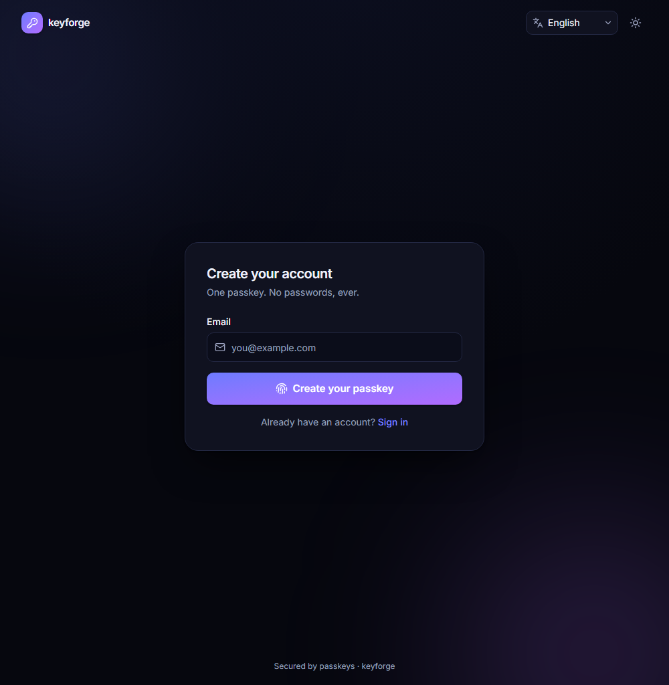
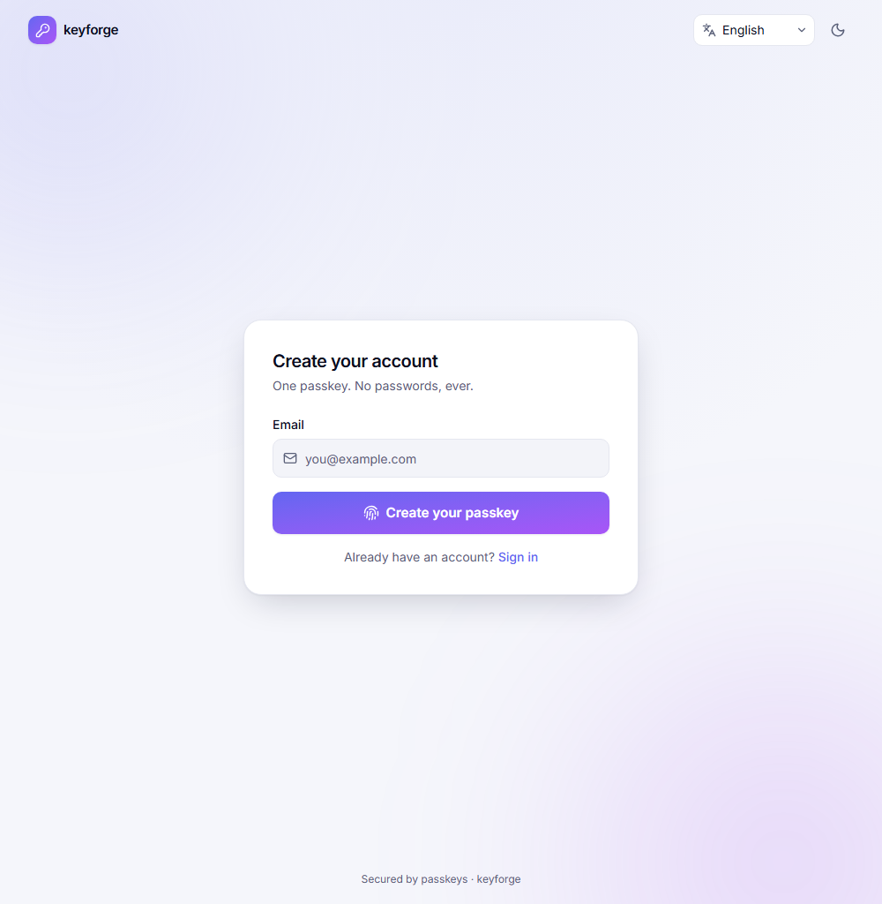
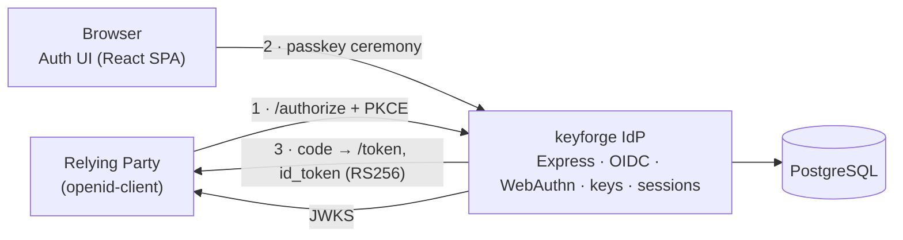

# keyforge

Self-hosted **OpenID Connect Identity Provider** with passwordless **passkey (WebAuthn/FIDO2)** sign-in.
You don't wire up someone else's Auth0 — keyforge **is** the OIDC provider.

[](https://keyforge-rp.onrender.com)
[](https://github.com/serega1806bizin/keyforge/actions/workflows/ci.yml)
[](LICENSE)


**Live demo:** **https://keyforge-rp.onrender.com** — open the demo app, click **Login with keyforge**,
register a passkey, approve consent, and you're signed back into the app. The identity provider itself
lives at [keyforge-idp.onrender.com/signup](https://keyforge-idp.onrender.com/signup).
_(Free tier: the first request may take ~30–60s to wake the instances.)_

A production-grade OAuth 2.1 / OpenID Connect authorization server, implemented end-to-end with
**passkeys as the only first factor**: discovery, JWKS with key rotation, authorization-code + PKCE,
refresh-token rotation with reuse detection, UserInfo, token revocation & introspection, dynamic client
registration, RP-initiated logout, and cross-app single sign-on.

## Screenshots

| Sign-up — dark | Sign-up — light |
| --- | --- |
|  |  |

The login, consent, and account-management screens share the same design system (React 19 + Tailwind v4,
light/dark, tasteful motion, English/Ukrainian). Try them in the [live demo](https://keyforge-rp.onrender.com).

## Architecture



The IdP and its React auth UI are served from a single origin (required for first-party cookies and the
WebAuthn `RP_ID`); relying parties integrate over standard OIDC.

## What it does

- **OAuth 2.1 / OIDC core** — authorization-code with mandatory **PKCE (S256)**, `id_token` (RS256, with
  `at_hash` / `auth_time` / `nonce` / `acr` / `amr`), JWT access tokens (RFC 9068 `at+jwt`), UserInfo,
  discovery, and a multi-key **JWKS with rotation + grace period**.
- **Passwordless** — usernameless, discoverable **passkeys** with signature-counter clone detection,
  conditional-UI autofill, and argon2-hashed recovery codes.
- **Token security** — **refresh-token rotation with reuse detection** (a replayed token revokes the whole
  family), single-use authorization codes with replay → family revocation, and RFC 9207 `iss`.
- **Sessions & SSO** — HttpOnly `__Host-` cookies, sliding idle + absolute expiry, anti-fixation, remembered
  consent, and **cross-app single sign-on**.
- **Standards surface** — token revocation (RFC 7009), introspection (RFC 7662, owner-scoped), dynamic
  client registration (RFC 7591), and RP-initiated logout.
- **Operations** — admin client CRUD + key rotation, account self-service (passkeys, sessions, recovery
  codes), an append-only audit log, and signing keys **AES-256-GCM-encrypted at rest**.
- **Polished UI** — React 19 + Tailwind v4, light/dark theme, tasteful motion, accessibility, and
  **internationalization (English + Ukrainian)**.

## Security model

- Phishing-resistant **passkeys** (origin-bound WebAuthn) as the primary factor; no passwords anywhere.
- **PKCE S256 enforced** (`plain` rejected); exact `redirect_uri` allow-list (no wildcards); `iss` in the
  authorization response (RFC 9207 mix-up mitigation).
- **Refresh-token theft response**: reuse of a rotated/revoked token revokes the entire token family.
- Signing keys encrypted at rest; secrets validated to ≥ 32 chars; tokens hashed (SHA-256) and secrets
  hashed with argon2.
- Same-origin CSRF defense, `frame-ancestors 'none'` (clickjacking), HSTS + a strict CSP, and per-endpoint
  rate limiting.

## Tech stack

Node 22 · TypeScript (strict, ESM) · Express 5 · Prisma 7 + PostgreSQL · `jose` · `@simplewebauthn` ·
Zod 4 · React 19 + Vite + Tailwind v4 · pnpm workspaces · Docker · GitHub Actions.

```
apps/
  server/     IdP backend (OIDC core, WebAuthn, keys, sessions, admin)
  web/        auth UI (React + Vite): sign-up · login · consent · account
  sample-rp/  demo relying party (openid-client) for the end-to-end flow
packages/
  shared/     framework-free zod contracts shared by server and web
```

## Tested (CI green on every push)

| Suite | Coverage |
| --- | --- |
| `@keyforge/server` | Unit/integration — key encryption & rotation, PKCE, clone detection |
| `@keyforge/sample-rp` | Real `openid-client` end-to-end **+ an OIDC conformance suite** |
| `@keyforge/web` | Playwright **virtual-authenticator** e2e: passkey login + SSO + account self-management |

GitHub Actions runs typecheck, ESLint, Prettier, build, and all three suites (with a PostgreSQL service)
on every push.

## Run it locally

```bash
pnpm install
pnpm certs                       # local TLS cert for id.localtest.me (mkcert or OpenSSL)
cp .env.example .env

docker compose up -d postgres
pnpm db:migrate
pnpm db:seed

# IdP on the host (issuer = the SPA origin, no cert prompt):
ISSUER_URL=http://localhost:5173 RP_ORIGIN=http://localhost:5173 RP_ID=localhost \
  pnpm --filter @keyforge/server start
pnpm --filter @keyforge/web dev          # http://localhost:5173/signup
pnpm --filter @keyforge/sample-rp dev    # http://localhost:4000 → "Login with keyforge"
```

`pnpm test` runs the unit/integration + conformance suites; `pnpm test:e2e` runs the Playwright flow.

## Deploy (free)

A [`render.yaml`](render.yaml) blueprint deploys the whole stack on Render's free tier: in the Render
dashboard choose **New → Blueprint**, connect this repository, and apply. It provisions PostgreSQL, builds
both Docker services, generates the signing/session secrets, and cross-wires the public URLs automatically.

For a long-lived demo, point `DATABASE_URL` at a persistent free Postgres (e.g. Neon). The same Dockerfiles
run unchanged on any container host (Railway, Fly, a VPS with the included `docker-compose.yml` + nginx).

## License

[MIT](LICENSE)
